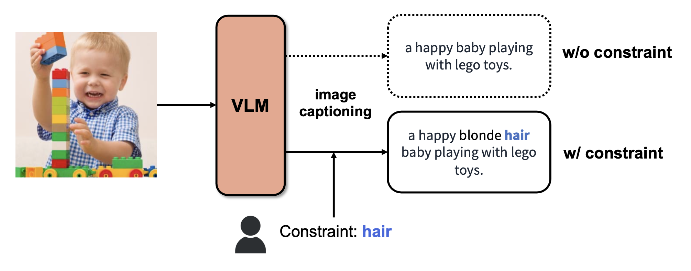

[](https://classroom.github.com/a/RT0PS4cg)

# Constrained Image Captioning applying User Preferences

AAI3201 Fall 2023 - Final Project

## Team FutureFlow
Member: 안민용, 전재현, 강종서

## Problem Overview


## How to run
(1) Dependencies (python 3.7)
```
pip install -r requirements.txt
```
(2-1) Test on dataset (in `cic_data` folder)
```
python test_constrained_blip2.py
```
(2-2) Demo
```
python demo_constrained_blip2.py
```
- Access http://localhost:7860 (gradio)

## File Description
- `test_constrained_blip2.py` : constrained blip2 result for cic dataset in `./cic_data`
    - result to be saved in `./result.json`
- `demo_constrained_blip2.py` : demo for constrained blip2
- `generate_blip2.py` : generate code for blip2 (from Huggingface)
- `generate_lm.py` : generate code for language part of blip2 (from Hugginface)
- `constrained_beam_search.py` : constrained decoding part (from NeuroLogic Decoding)
- `topK.py`, `lexical_constraints.py` : utils for NeuroLogic Decoding (from NeuroLogic Decoding)

## Reference
- NeuroLogic Decoding (Lu et al.) : https://github.com/GXimingLu/neurologic_decoding

```
@inproceedings{lu-etal-2021-neurologic,
    title = "{N}euro{L}ogic Decoding: (Un)supervised Neural Text Generation with Predicate Logic Constraints",
    author = "Lu, Ximing  and  West, Peter  and  Zellers, Rowan  and  Le Bras, Ronan  and  Bhagavatula, Chandra  and  Choi, Yejin",
    booktitle = "Proceedings of the 2021 Conference of the North American Chapter of the Association for Computational Linguistics: Human Language Technologies",
    month = jun,
    year = "2021",
    address = "Online",
    publisher = "Association for Computational Linguistics",
    url = "https://aclanthology.org/2021.naacl-main.339",
    doi = "10.18653/v1/2021.naacl-main.339",
    pages = "4288--4299",
    abstract = "Conditional text generation often requires lexical constraints, i.e., which words should or shouldn{'}t be included in the output text. While the dominant recipe for conditional text generation has been large-scale pretrained language models that are finetuned on the task-specific training data, such models do not learn to follow the underlying constraints reliably, even when supervised with large amounts of task-specific examples. We propose NeuroLogic Decoding, a simple yet effective algorithm that enables neural language models {--} supervised or not {--} to generate fluent text while satisfying complex lexical constraints. Our approach is powerful yet efficient. It handles any set of lexical constraints that is expressible under predicate logic, while its asymptotic runtime is equivalent to conventional beam search. Empirical results on four benchmarks show that NeuroLogic Decoding outperforms previous approaches, including algorithms that handle a subset of our constraints. Moreover, we find that unsupervised models with NeuroLogic Decoding often outperform supervised models with conventional decoding, even when the latter is based on considerably larger networks. Our results suggest the limit of large-scale neural networks for fine-grained controllable generation and the promise of inference-time algorithms.",
}
```